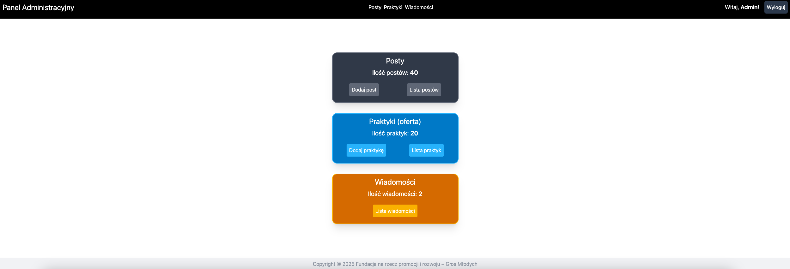

# Fundacja Głos Młodych

- Formularz kontaktowy: po wypełnieniu i wysłaniu formularza zostaje on zapisany w bazie danych. Admin może zobaczyć szczegóły wiadomości w panelu administracyjnym.

- Opinie: opnie są zapisywane i pobierane z bazy danych.

## Panel Administracyjny

Panel administracyjny pozwala na:

- wyświetlanie, edytowanie i usuwanie postów (projekty, aktualności, sprawozdania),
- wyświetlanie, edytowanie i usuwanie praktyk, które są w ofercie Fundacji,
- wyświetlanie wiadomości, które zostały wysłane przez formularz kontaktowy.
